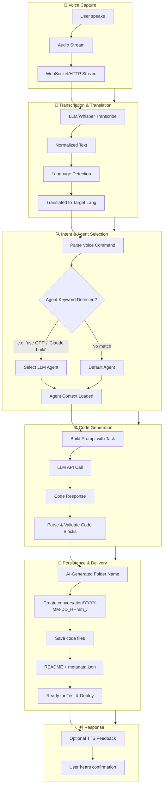
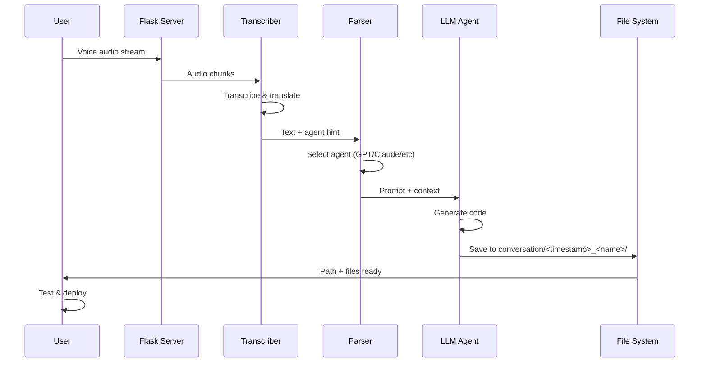

# VAMP — Voice AI Multimodal Prompter

Build applications through natural voice conversation. Speak your intent, select an AI coding agent by voice, and receive deployable code output—all in real time.

---

## Workflow Process Flow

### High-Level Flow

```
Voice Input → Transcription → Agent Selection → Code Generation → Output & Persistence
```

### Mermaid Diagram



### Sequence Diagram



---

## Component Description (Tabular)

| Component | Description | Responsibility |
|-----------|-------------|----------------|
| **Voice Capture** | Microphone / browser MediaRecorder or CLI audio input | Streams raw audio to server |
| **Transcriber** | OpenRouter (Gemini Flash audio) | Converts speech → text via single API |
| **Command Parser** | Regex or small LLM | Extracts task + agent selector from transcribed text |
| **Agent Registry** | Map of agent names → OpenRouter model IDs | Routes to correct LLM (GPT-4, Claude, etc.) via OpenRouter |
| **Code Generator** | OpenRouter + selected LLM | Receives task, produces code + folder name via single API |
| **Conversation Store** | Local `conversation/` directory | Saves each session with timestamp + AI-generated name |
| **Output Packager** | File writer | Writes `main.py`, `requirements.txt`, `README`, `metadata.json` |
| **TTS (Optional)** | Text-to-speech | Reads back status or errors to user |

---

## Docker

### Pull & Run

```bash
docker run -d \
  -p 5000:5000 \
  -e OPENROUTER_API_KEY=your_key \
  -v ./conversation:/vamp/conversation \
  ronvoy/vamp:latest
```

### Build Locally

```bash
docker build -t vamp .
docker run -d \
  -p 5000:5000 \
  -e OPENROUTER_API_KEY=your_key \
  -v ./conversation:/vamp/conversation \
  vamp
```

### Environment Variables

| Variable | Required | Default | Description |
|----------|----------|---------|-------------|
| `OPENROUTER_API_KEY` | Yes | — | API key for OpenRouter |
| `TRANSCRIBE_MODEL` | No | `google/gemini-2.5-flash` | Model for voice transcription |
| `DEFAULT_AGENT` | No | `openai` | Default LLM agent |
| `PORT` | No | `5000` | Server port |

> Mount `-v ./conversation:/vamp/conversation` to persist generated projects across container restarts.

---

## Implementation Steps & Caveats

| Step | Implementation | Caveats |
|------|----------------|---------|
| **1. Voice Capture** | Use `navigator.mediaDevices.getUserMedia()` + `MediaRecorder` (browser) or `pyaudio`/`sounddevice` (Python) for streaming. Chunk audio every 1–3 seconds. | Latency vs. accuracy tradeoff; long chunks = slower responses. |
| **2. Transcription** | Integrate OpenAI Whisper API or local Whisper. For translation, add a post-step LLM or use Whisper's `language` + translation model. | API cost; rate limits; background noise degrades quality. |
| **3. Agent Selection** | Parse keywords like "use GPT", "Claude build", "with Codex". Map to `openai`, `anthropic`, etc. Use a small LLM or regex for reliability. | Ambiguous commands may need fallback; case insensitivity recommended. |
| **4. Code Generation** | Build a system prompt with rules (e.g., always output runnable code, use `main.py`, include `requirements.txt`). Call selected LLM. | Token limits; malformed output; need robust markdown/code-block parsing. |
| **5. Folder Naming** | Ask the same LLM to suggest a short, kebab-case folder name from the task (e.g., `todo-cli`, `weather-dashboard`). Sanitize (no special chars). | Avoid overwriting; add timestamp prefix. |
| **6. Persistence** | Create `conversation/YYYY-MM-DD_HHmm_<name>/`, write files, add `metadata.json` (task, agent, timestamp). | Ensure atomic writes; handle disk full. |
| **7. Run & Deploy** | Provide `run.sh` or instructions in each folder. Optional: auto `pip install -r requirements.txt && python main.py`. | Virtual env isolation; dependencies may fail. |

---

## Project Structure

```
VAMP/
├── README.md
├── setup_voice_app_server.sh      # Shell script to bootstrap Flask server
├── app/                           # Generated by setup script
│   ├── app.py                     # Flask app + WebSocket/streaming
│   ├── transcriber.py             # Whisper/LLM transcription
│   ├── agent_registry.py          # Agent selection & routing
│   ├── code_generator.py          # LLM code generation
│   ├── conversation_store.py      # Save to conversation/
│   ├── requirements.txt
│   └── .env.example
├── conversation/                  # Output folder (created at runtime)
│   └── 2025-02-28_1430_todo-cli/
│       ├── main.py
│       ├── requirements.txt
│       ├── README.md
│       └── metadata.json
└── static/                        # Optional web UI
    └── voice.html
```

---

## How to Run

### Prerequisites

- Python 3.10+
- FFmpeg (for audio processing)
- **OpenRouter API key** — all LLM calls and voice transcription (Gemini Flash) via single key
- **FFmpeg** — for audio conversion (webm → wav); often bundled with pydub

### Quick Start

1. **Bootstrap the server** (run once):

   ```bash
   chmod +x setup_voice_app_server.sh
   ./setup_voice_app_server.sh
   ```

2. **Configure environment**:

   ```bash
   cd app
   cp .env.example .env
   # Edit .env with OPENROUTER_API_KEY (LLM) and OPENAI_API_KEY (Whisper)
   ```

3. **Start the server**:

   ```bash
   python app.py
   ```

4. **Use the app**:
   - Open `http://localhost:5000` in a browser — hold the record button, speak your task (e.g. “use GPT, make a todo CLI”), release to send
   - Or use the REST API: `curl -X POST -F "audio=@recording.webm" http://localhost:5000/api/voice`

5. **Check output**:
   - New sessions appear in `conversation/`
   - Each folder contains runnable code; follow the `README` in the folder for test/deploy steps

### API Endpoints (Typical)

| Endpoint | Method | Description |
|----------|--------|-------------|
| `/` | GET | Web UI or health check |
| `/api/transcribe` | POST | Upload audio, get text + agent hint |
| `/api/generate` | POST | Send text task + agent, get code + folder path |
| `/api/stream` | WebSocket | Full pipeline: voice → transcribe → generate → save |

---

## License

MIT
