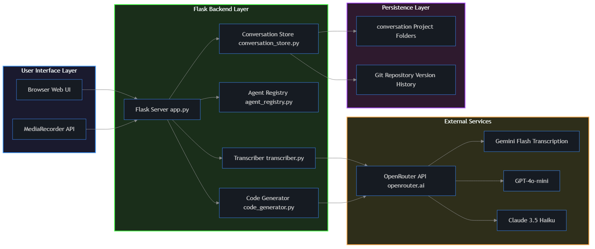
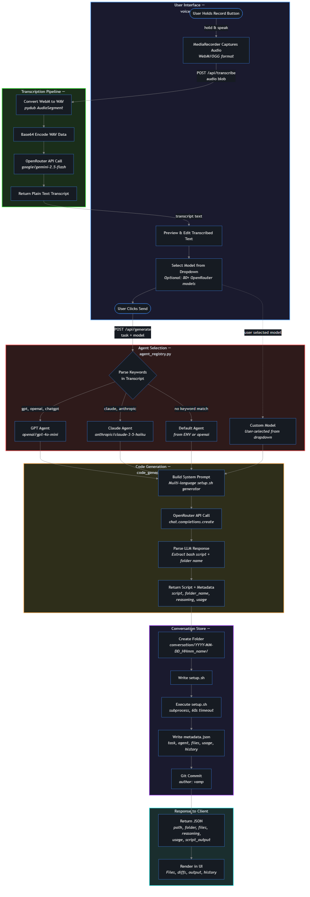
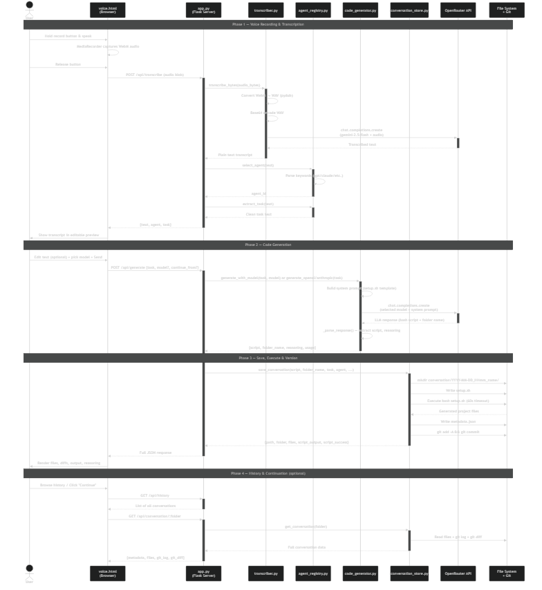
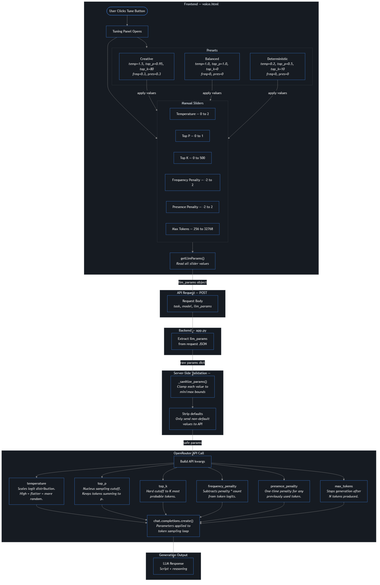

# AI System Engineering

## Technical Report: VAMP — Voice Application Multi-LLM Platform

**Course:** AI System Engineering  
**Project Supervisor:** Prof. Roberto Pietrantuono
**Report by:** Hussain Ullah Baig (D03000205), Rohan Baidya (D03000192)
**Github Link:** https://github.com/ronvoy/vamp
**Project:** VAMP — A Voice-Driven AI Code Generation System  

---

## 1. Executive Summary

VAMP turns voice commands into runnable software projects. A user speaks into the browser, the system transcribes the audio, picks an LLM agent, generates a project scaffold as a bash script, runs it, and saves everything with git history. The backend is Flask, the frontend is a single HTML file, and all LLM calls go through OpenRouter.

---

## 2. System Architecture

### 2.1 Architecture Overview



The system has four layers:

| Layer | Components | What it does |
|-------|-----------|----------------|
| **Presentation** | Browser SPA | Audio recording, text editing, model picker, result display |
| **Application** | Flask server | REST routing, request handling, response assembly |
| **Service** | Transcriber, Agent Registry, Code Generator | Speech-to-text, agent routing, LLM prompting and parsing |
| **Persistence** | Conversation Store, Git | File storage, metadata, version control |

The frontend talks to the backend only through REST calls. Each service module can be swapped out without touching the others. All file and git operations go through one module (conversation_store).

### 2.2 External Dependencies

| Dependency | Version | What it does |
|-----------|---------|---------|
| Flask | >= 3.0.0 | HTTP server, routing, static files |
| Flask-CORS | >= 4.0.0 | Cross-origin requests for local dev |
| OpenAI SDK | >= 1.6.0 | Client for OpenRouter's API |
| python-dotenv | >= 1.0.0 | Loads config from `.env` at startup |
| pydub | >= 0.25.1 | Converts WebM/OGG audio to WAV |
| requests | >= 2.31.0 | Fetches model catalog from OpenRouter |

---

## 3. Process Workflow

### 3.1 End-to-End Workflow



The diagram shows the full data flow: voice in, transcript out, agent picked, code generated, files saved, result shown.

### 3.2 Sequence Diagram



This shows the message flow between components, including the external API calls and the four processing phases.

### 3.3 Workflow Phases

| Phase | Name | What happens |
|-------|------|-------------|
| 1 | **Recording & Transcription** | Browser captures audio (WebM), sends it to the server. Server converts to WAV via pydub, Base64-encodes it, sends it to an LLM with audio input support. The transcript appears in an editable text area. |
| 2 | **Agent Selection** | The agent registry scans the transcript for keywords like "gpt" or "claude" to pick an LLM. Keywords are stripped from the text so the model gets a clean task. If nothing matches, the default agent is used. Users can also pick a model manually from the dropdown. |
| 3 | **Code Generation** | The task goes into a system prompt that tells the LLM to produce a bash `setup.sh` script with heredoc file creation. The response is parsed with regex to pull out the script, a folder name, and the model's reasoning. Token usage is tracked. |
| 4 | **Persistence & Execution** | A timestamped folder is created, the script is run with a 60-second timeout, all files are cataloged in a JSON metadata file, and everything gets committed to git. Continuations update the existing folder and append a new commit. |

---

## 4. Component Detail

### 4.1 Transcription Module

Takes raw audio bytes from the browser (WebM/OGG), converts to WAV using pydub (which uses ffmpeg under the hood), Base64-encodes the result, and sends it as an `input_audio` block in a chat completion request. The prompt just says "transcribe this audio exactly." If WAV conversion fails (e.g., ffmpeg not installed), it falls back to sending the raw bytes.

Using an LLM with audio support for transcription instead of a separate speech-to-text service means everything goes through one API endpoint (OpenRouter). The default model is Gemini 2.5 Flash — fast, cheap, and handles audio well.

| Attribute | Detail |
|-----------|--------|
| Default Model | Google Gemini 2.5 Flash |
| Input Formats | WebM, OGG → converted to WAV |
| Output | Plain text transcript |
| Fallback | Sends raw bytes if format conversion fails |

### 4.2 Agent Registry

Two-step process:

1. **`select_agent()`** — scans the transcript (case-insensitive) for keywords like "gpt", "openai", "claude", "anthropic". Maps them to an agent ID. Falls back to a default if nothing matches.
2. **`extract_task()`** — removes the matched keywords using word-boundary regex so the LLM gets a clean prompt.

Users can also bypass this entirely by selecting a model from the UI dropdown.

| Agent ID | Keywords | Model | Notes |
|----------|---------|-------|-------|
| openai | gpt, openai, chatgpt | GPT-4o-mini | General-purpose |
| anthropic | claude, anthropic | Claude 3.5 Haiku | Strong reasoning |
| (custom) | — | Any OpenRouter model | Manual selection |

### 4.3 Code Generator

Sends a system prompt + user task to the selected LLM. The system prompt tells the model to output a `setup.sh` bash script that creates all project files using heredocs (single-quoted EOF to avoid shell expansion). It includes a platform-to-language table (iOS → Swift, Android → Kotlin, web → HTML/CSS/JS, etc.) and requires a README in every project. The response must end with a `FOLDER_NAME:` line for naming the output folder.

**Parsing:** Regex extracts the first bash code block as the script, text before it as reasoning, and the `FOLDER_NAME:` directive. If no code block is found, the raw response is wrapped in a diagnostic script so nothing is lost silently.

**Continuation:** For follow-up requests, the previous project's files and metadata are prepended as context so the LLM can produce incremental updates.

**Model catalog:** `fetch_models()` pulls the full model list from OpenRouter and caches it for one hour. The UI shows model names, context sizes, and pricing.

| Attribute | Detail |
|-----------|--------|
| API | OpenRouter (openrouter.ai/api/v1) |
| Default Model | Gemma 3 27B Instruct |
| Max Tokens | 8,192 (tunable up to 32,768) |
| Cache TTL | 3,600 seconds |
| Platforms | iOS/Swift, Android/Kotlin, Web, Python, Go, Rust, TypeScript/React, Java |

#### LLM Tuning Parameters

Users can adjust generation behavior directly from the UI. A "Tune" button next to the model selector opens a panel with six sliders. Each parameter is validated and clamped server-side before being passed to the OpenRouter API.



| Parameter | Range | Default | Description |
|-----------|-------|---------|-------------|
| Temperature | 0 – 2 | 1.0 | Controls randomness. Higher values produce more varied output; lower values are more focused and repetitive. |
| Top P | 0 – 1 | 1.0 | Nucleus sampling threshold. The model considers tokens whose cumulative probability reaches this value. Lower values narrow the token pool. |
| Top K | 0 – 500 | 0 (disabled) | Limits the model to the K most likely tokens at each step. 0 means no limit. Lower values reduce randomness. |
| Frequency Penalty | -2 – 2 | 0 | Penalizes tokens proportionally to how often they have already appeared. Positive values discourage repetition. |
| Presence Penalty | -2 – 2 | 0 | Penalizes tokens that have appeared at all, regardless of frequency. Positive values encourage topic diversity. |
| Max Tokens | 256 – 32,768 | 8,192 | Maximum number of tokens the model can generate in its response. |

#### Tuning Presets

Three presets apply predefined slider values for common use cases:

| Preset | Temperature | Top P | Top K | Freq. Penalty | Pres. Penalty | Max Tokens | Use Case |
|--------|-------------|-------|-------|---------------|---------------|------------|----------|
| **Creative** | 1.50 | 0.95 | 80 | 0.30 | 0.30 | 8,192 | Brainstorming, exploratory generation, diverse output |
| **Balanced** | 1.00 | 1.00 | 0 | 0.00 | 0.00 | 8,192 | General-purpose tasks (default) |
| **Deterministic** | 0.20 | 0.50 | 10 | 0.00 | 0.00 | 8,192 | Predictable, consistent output for structured tasks |

### 4.4 Conversation Store

Handles project creation, execution, metadata, git, renaming, and deletion.

- **Creation:** Makes a folder like `2026-03-10_1430_weather-dashboard/` under `conversation/`. Folder names are sanitized to lowercase alphanumerics and hyphens, max 50 characters.
- **Execution:** Writes `setup.sh` and runs it via `subprocess.run()` with a 60-second timeout to prevent runaway scripts.
- **Metadata:** Saves a `metadata.json` with the task, model, timestamp, file list, reasoning, raw response, token counts, stdout/stderr, success flag, and iteration history.
- **Git:** Initializes a repo in `conversation/` and commits after every create/update/delete. Commit messages include the agent name and a task summary. Author is set to "vamp".
- **Continuation:** Loads existing project files as context for incremental updates. New commits are appended to the history.
- **Deletion/Rename:** `shutil.rmtree()` for deletion, prefix-preserving rename. Both validate against path traversal.

### 4.5 Web Interface

A single `voice.html` file (~1,500 lines, vanilla JS/CSS/HTML) served by Flask. No build step, no framework.

- **Recording:** Hold-to-record using MediaRecorder API. Visual feedback via CSS animations.
- **Transcript editing:** The transcription result is shown in an editable textarea so users can fix errors before generating.
- **Model dropdown:** Searchable, keyboard-navigable. Shows model name, context size, and per-token pricing.
- **LLM tuning panel:** A collapsible panel with six sliders (temperature, top_p, top_k, frequency penalty, presence penalty, max tokens) and three presets (Creative, Balanced, Deterministic). Values are sent with every generation request.
- **History sidebar:** Lists all projects newest-first with search, rename, and delete. Clicking a project shows its files, git log, and diffs.
- **Result view:** Shows generated files, execution output, reasoning, and raw response. Git diffs between iterations. Dark/light theme toggle saved to localStorage. GSAP handles animations.

### 4.6 REST API

Nine endpoints:

| Endpoint | Method | Purpose |
|----------|--------|---------|
| `/` | GET | Redirects to the web UI |
| `/api/transcribe` | POST | Audio in, transcript + agent + task out |
| `/api/generate` | POST | Task + model + tuning params in, generated project out |
| `/api/voice` | POST | Audio in, generated project out (combined pipeline) |
| `/api/models` | GET | Full model catalog with pricing (cached) |
| `/api/history` | GET | List of all projects |
| `/api/conversation/:folder` | GET | Full project details with files, commits, diffs |
| `/api/conversation/:folder/rename` | PUT | Rename a project |
| `/api/conversation/:folder` | DELETE | Delete a project |

All return JSON. Folder parameters are checked for path traversal. Audio uploads are validated for content.

---

## 5. Data Flow

| Step | Component | Input | What happens | Output |
|------|-----------|-------|-------------|--------|
| 1 | Browser | Voice | MediaRecorder captures WebM | Audio blob |
| 2 | Transcriber | WebM bytes | Convert to WAV, Base64, send to LLM | Transcript text |
| 3 | Agent Registry | Transcript | Keyword scan, keyword removal | Agent ID + clean task |
| 4 | Code Generator | Task + model | System prompt → LLM → regex parse | Script + folder name + reasoning |
| 5 | Conv. Store | Script | Create folder, run with timeout, save metadata, git commit | Versioned project |
| 6 | Browser | JSON response | Render files, diffs, logs | Visual output |

---

## 6. Technology Stack

| Category | Technology | Role |
|----------|-----------|------|
| **Backend** | Python 3.10+ | Server-side language |
| **Framework** | Flask 3.x | HTTP server, routing, static files |
| **Frontend** | HTML5, CSS3, Vanilla JS | SPA, no build tools |
| **Animation** | GSAP (CDN) | UI transitions |
| **LLM Gateway** | OpenRouter API | Access to 80+ models via one key |
| **Transcription** | Gemini 2.5 Flash | Audio-to-text via LLM |
| **Code Gen** | GPT-4o-mini, Claude 3.5 Haiku, Gemma 3 27B | Selectable LLMs |
| **Audio** | pydub + ffmpeg | WebM → WAV conversion |
| **Version Control** | Git (subprocess) | Auto-commits per project |
| **Config** | python-dotenv | `.env` file loading |

---

## 7. Project Structure

```
vamp/
├── app/
│   ├── app.py                  # Flask server with REST API endpoints
│   ├── transcriber.py          # Voice-to-text via LLM audio transcription
│   ├── agent_registry.py       # Keyword-based agent routing
│   ├── code_generator.py       # Structured LLM prompting and response parsing
│   ├── conversation_store.py   # Project lifecycle management with git integration
│   ├── requirements.txt        # Python package dependencies
│   ├── .env                    # Runtime configuration (not committed)
│   ├── .env.example            # Configuration template with documentation
│   └── static/
│       └── voice.html          # Complete single-page web interface
├── conversation/               # Generated projects directory (git-tracked)
├── Dockerfile                  # Container image definition
├── .dockerignore               # Build context exclusion rules
├── _report/
│   ├── report.md               # This technical report
│   ├── slide.md                # Presentation slide notes
│   └── diagrams/               # Rendered diagram assets (PNG)
└── README.md                   # Project overview and quick start guide
```

---

## 8. Design Decisions

| Decision | Why |
|----------|-----|
| **Single OpenRouter API key** | One key for all models. No separate vendor accounts needed. Switching models is just a parameter change. |
| **Bash heredocs as output** | The LLM generates one `setup.sh` that creates all files via heredocs. Works for any language — Python, Swift, TypeScript, whatever. |
| **Git-based versioning** | Auto-commit after every create/update/delete. Get diffs, history, and rollback for free without building custom logic. |
| **Files over database** | JSON metadata + git is enough. No DB setup, projects are just folders you can copy around. |
| **Vanilla JS frontend** | One HTML file, no build step, no node_modules. Drop it in Flask's static folder and it works. |
| **60-second timeout** | LLM-generated scripts could hang or loop. The timeout kills anything that runs too long. |
| **Keyword-based routing** | Simple keyword matching for agent selection. Say "use GPT" and you get GPT. Predictable, no surprises. |

---

## 9. Security Considerations

| Concern | How it's handled |
|---------|-----------------|
| **API keys** | Stored in `.env`, excluded from git. Loaded at runtime via python-dotenv. |
| **Script execution** | Runs in a subprocess with captured stdout/stderr and a 60-second timeout. |
| **Path traversal** | Folder inputs are validated before any filesystem access. |
| **Input sanitization** | Folder names are stripped to `[a-z0-9-]` only, max 50 characters. |
| **CORS** | Open for local dev. Would be locked down for production. |
| **No database** | No SQL, so no SQL injection. Data is flat files with controlled serialization. |

---

## 10. Docker Containerization

The project is containerized and published to Docker Hub at `ronvoy/vamp:latest`.

### 10.1 Dockerfile Structure

| Layer | Instruction | What it does |
|-------|-------------|----------|
| **Base** | `FROM python:3.10-slim` | Minimal Python runtime (~185 MB) |
| **System deps** | `RUN apt-get install ffmpeg git` | ffmpeg for audio conversion, git for version control |
| **Work dir** | `WORKDIR /vamp` | Mirrors local project layout for correct path resolution |
| **Pip install** | `COPY requirements.txt` → `RUN pip install` | Dependencies cached separately from code |
| **App code** | `COPY app/ app/` | Flask server, modules, static files |
| **Output dir** | `RUN mkdir -p /vamp/conversation` | Pre-created for volume mount |
| **Port** | `ENV PORT=5000`, `EXPOSE 5000` | Default port config |
| **Start** | `CMD ["python", "app.py"]` | Runs the Flask server |

### 10.2 Excluded from Image

| Pattern | Why |
|---------|-----|
| `.git/`, `.env` | No secrets or history in the image |
| `conversation/` | Runtime data, mounted as a volume |
| `_report/` | Documentation only |
| `__pycache__/`, `.venv/` | Regenerated/replaced at runtime |

### 10.3 Image Info

| | |
|--|--|
| **Size** | ~256 MB |
| **Base** | python:3.10-slim (Debian) |
| **Registry** | `ronvoy/vamp:latest` |

### 10.4 Commands

**Pull:**

```bash
docker pull ronvoy/vamp:latest
```

**Run:**

```bash
docker run -d \
  --name vamp \
  -p 5000:5000 \
  -e OPENROUTER_API_KEY=your_key \
  -v ./conversation:/vamp/conversation \
  ronvoy/vamp:latest
```

**Build locally:**

```bash
docker build -t vamp .
docker run -d -p 5000:5000 -e OPENROUTER_API_KEY=your_key -v ./conversation:/vamp/conversation vamp
```

**Logs / Stop:**

```bash
docker logs -f vamp
docker stop vamp && docker rm vamp
```

### 10.5 Environment Variables

Runtime config — nothing is hardcoded in the image.

| Variable | Required | Default | Description |
|----------|----------|---------|-------------|
| `OPENROUTER_API_KEY` | Yes | — | OpenRouter API key |
| `TRANSCRIBE_MODEL` | No | `google/gemini-2.5-flash` | Transcription model |
| `DEFAULT_AGENT` | No | `openai` | Fallback agent |
| `PORT` | No | `5000` | Server port |

### 10.6 Persistent Storage

Mount the conversation directory to keep generated projects across restarts:

```bash
-v /your/path/conversation:/vamp/conversation
```

---

## 11. Conclusion

VAMP takes voice input and turns it into runnable, version-controlled software projects. The architecture keeps things simple — Flask for the backend, one HTML file for the frontend, OpenRouter as the single API gateway, and git for versioning. Each module (transcription, routing, generation, storage) handles one job and can be replaced independently. The Docker image makes deployment straightforward: pull, set your API key, run.

Possible next steps: streaming LLM responses, multi-turn conversation support, auto-testing generated code, sandboxed execution, and multi-user collaboration via shared git.
